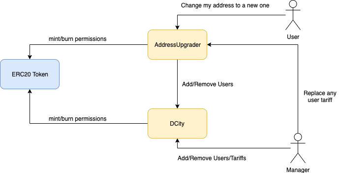

# DCtiy v2 обзор изменений

## ERC20

- удаляется Mintable trait (овнер имеет право на минт)
- право на минт назначается 2м контрактам: DCity и AddressUpgrader
- право на берн назначается контракту: AddressUpgrader

## DCity

- без изменений

## AddressUpgrader
- Имеет права `MEMBER_JOIN_MANAGER_ROLE` и `MEMBER_LEAVE_MANAGER_ROLE` в контракте `DCity`
- Пользователь владелец текущего адреса может изменить свой адрес на новый
- Пользователь с ролью SUPERUSER_ROLE может менять любой адрес на любой адрес, назначается нескольким менеджерам

## Прочее
- Версия solidity обновляется до 0.5.16 (0.6.x игнорируется)
- Версия OpenZeppelin обновляется до последней стабильной версии 2.4.0
